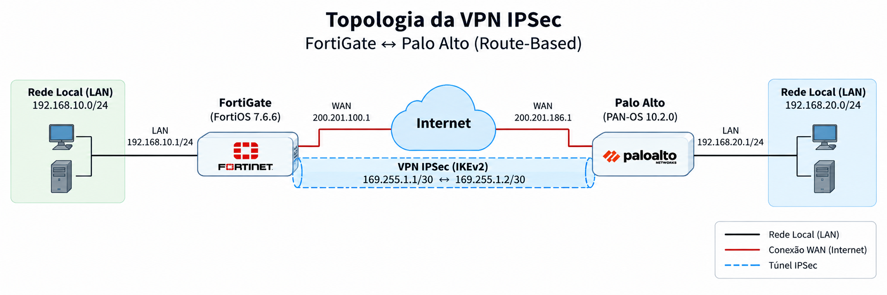

# Plano de Automação de VPN IPSec entre FortiGate e Palo Alto

## 1. Objetivo

O objetivo deste documento é realizar o planejamento da automação da configuração de uma VPN IPSec entre um dispositivo FortiGate e um firewall Palo Alto.

Para este planejamento estão sendo consideradas as versões **FortiOS 7.6.6** para o FortiGate e **PAN-OS 10.2.0** para o Palo Alto.

## 2. Topologia

Para o planejamento da VPN IPSec será considerada a seguinte topologia:

| Parâmetro | FortiGate | Palo Alto |
|---|---|---|
| IP WAN | 200.201.100.1 | 200.201.186.1 |
| Rede Local | 192.168.10.0/24 | 192.168.20.0/24 |
| IP do Túnel | 169.255.1.1/30 | 169.255.1.2/30 |

### 2.1 Tipo da VPN

Para este planejamento será utilizada uma VPN do tipo **Route-Based**, utilizando interfaces de túnel nos dois equipamentos.

O roteamento entre as redes `192.168.10.0/24` e `192.168.20.0/24` será realizado através das interfaces da VPN, utilizando os endereços `169.255.1.1/30` no FortiGate e `169.255.1.2/30` no Palo Alto.

### 2.2 Considerações para cenários com NAT ou Cloud

O cenário utilizado neste documento considera que os endereços IP públicos estão configurados diretamente nas interfaces WAN do FortiGate e do Palo Alto.

Dessa forma, cada firewall utiliza diretamente seu endereço WAN para estabelecer a comunicação com o peer remoto da VPN.

Em outros ambientes, principalmente em Cloud, o firewall pode utilizar um endereço IP privado em sua interface WAN e ter um endereço público associado através de NAT.

Exemplo:

FortiGate
IP da interface: 10.10.10.10
IP público/NAT: 200.201.100.2
        |
        | NAT
        |
     Internet
        |
Palo Alto
IP público: 200.201.186.2

Nesse cenário, os parâmetros utilizados pela automação podem precisar ser adaptados, pois o endereço IP configurado na interface do firewall pode ser diferente do endereço público utilizado pelo peer remoto para estabelecer a VPN.

Além do endereço do peer, ambientes com NAT podem exigir considerações adicionais, como:

- utilização de NAT Traversal (NAT-T);
- utilização de UDP/4500 após a detecção de NAT;
- configuração de Local IKE ID e Peer IKE ID, quando necessário;
- diferenciação entre o IP privado da interface e o IP público utilizado na VPN.

Esses parâmetros devem ser definidos de acordo com a arquitetura do ambiente e com a forma como cada fabricante realiza a identificação dos peers durante a negociação IKE.

## 3. Parâmetros da VPN

Serão utilizados parâmetros de criptografia e segurança suportados pelos dois equipamentos, conforme documentação oficial dos fabricantes.

As referências utilizadas para definição e validação dos parâmetros foram:

- [Fortinet - Phase 1 Configuration](https://docs.fortinet.com/document/fortigate/7.6.6/administration-guide/790613/phase-1-configuration)
- [Fortinet - Phase 2 Configuration](https://docs.fortinet.com/document/fortigate/7.6.6/administration-guide/604285/phase-2-configuration)
- [Palo Alto - Define IKE Crypto Profiles](https://docs.paloaltonetworks.com/network-security/ipsec-vpn/administration/set-up-site-to-site-vpn/define-cryptographic-profiles/define-ike-crypto-profiles)
- [Palo Alto - Define IPSec Crypto Profiles](https://docs.paloaltonetworks.com/network-security/ipsec-vpn/administration/set-up-site-to-site-vpn/define-cryptographic-profiles/define-ipsec-crypto-profiles)

### 3.1 Phase 1 - IKE

| Parâmetro | Configuração |
|---|---|
| Versão IKE | IKEv2 |
| Criptografia | AES-256 |
| Integridade | SHA-256 |
| Diffie-Hellman | Grupo 20 |
| Autenticação | Pre-Shared Key (PSK) |
| Lifetime | 28800 segundos |

A Phase 1 é a responsável pelo estabelecimento da comunicação segura entre os dois peers da VPN.

### 3.2 Phase 2 - IPSec

| Parâmetro | Configuração |
|---|---|
| Criptografia | AES-256 |
| Integridade | SHA-256 |
| PFS | Habilitado |
| Grupo PFS | Grupo 20 |
| Lifetime | 3600 segundos |

A Phase 2 é responsável pela criação das associações de segurança IPSec utilizadas para proteger o tráfego entre as redes dos dois ambientes.

## 4. Ferramentas e APIs

Para realizar a automação será utilizado um script desenvolvido em Python, responsável por interagir com os firewalls através das APIs disponibilizadas por cada fabricante.

### 4.1 FortiGate

Para o FortiGate será utilizada a REST API do FortiOS através de requisições HTTPS realizadas pelo script Python.

Para autenticação será utilizado um usuário do tipo REST API Administrator com token de acesso e permissões limitadas às operações necessárias para a automação.

### 4.2 Palo Alto

Para o Palo Alto será utilizada principalmente a XML API do PAN-OS, permitindo realizar as configurações necessárias, consultar o estado do equipamento e realizar o commit das alterações.

A autenticação será realizada através de uma API Key associada a um usuário com as permissões necessárias para execução da automação.

### 4.3 Segurança das Credenciais

Tokens de acesso, API Keys, senhas e a Pre-Shared Key (PSK) utilizada pela VPN não deverão ser armazenados diretamente no código ou publicados no repositório Git.

As credenciais necessárias para execução da automação poderão ser fornecidas ao script através de variáveis de ambiente ou outro mecanismo seguro de armazenamento de credenciais.

## 5. Passos da Automação

### 5.1 Validação dos Parâmetros

Antes de iniciar as configurações, o script deverá validar os parâmetros informados para a criação da VPN.

Serão validados os endereços IP dos equipamentos, redes locais, endereços do túnel e os parâmetros utilizados nas Phases 1 e 2.

Caso algum parâmetro esteja incorreto ou ausente, a automação deverá ser interrompida antes de realizar qualquer alteração nos equipamentos.

Vale ressaltar que, no FortiGate, as configurações realizadas através da API são aplicadas diretamente ao equipamento. Já no Palo Alto, após as alterações de configuração, é necessário realizar um commit para que elas sejam aplicadas.

### 5.2 Configuração do FortiGate

Após a validação dos parâmetros, o script deverá estabelecer a comunicação com o FortiGate e realizar as configurações necessárias para criação da VPN.

A automação deverá executar as seguintes etapas:

1. Validar a comunicação com o equipamento.
2. Configurar a Phase 1 da VPN utilizando os parâmetros IKE definidos.
3. Configurar a Phase 2 utilizando os parâmetros IPSec definidos.
4. Configurar o endereço IP 169.255.1.1/30 na interface do túnel.
5. Criar a rota para a rede 192.168.20.0/24 através da VPN.
6. Criar as políticas de firewall necessárias para permitir a comunicação entre as redes.

### 5.3 Configuração do Palo Alto

Após a configuração do FortiGate, o script deverá realizar a configuração correspondente no Palo Alto.

A automação deverá executar as seguintes etapas:

1. Validar a comunicação com o equipamento.
2. Criar o IKE Crypto Profile com os parâmetros definidos para a Phase 1.
3. Configurar o IKE Gateway apontando para o endereço WAN do FortiGate.
4. Criar o IPSec Crypto Profile com os parâmetros definidos para a Phase 2.
5. Criar e configurar a Tunnel Interface com o endereço 169.255.1.2/30.
6. Criar o IPSec Tunnel associando o IKE Gateway, o IPSec Crypto Profile e a Tunnel Interface.
7. Criar a rota para a rede 192.168.10.0/24 através da interface do túnel.
8. Criar as políticas de segurança necessárias para permitir a comunicação entre as redes.

### 5.4 Validação antes da Aplicação

Após realizar as configurações, o script deverá verificar se os objetos e parâmetros necessários para o funcionamento da VPN foram configurados corretamente nos dois equipamentos.

Caso seja identificado algum erro durante o processo, a automação deverá registrar a falha e interromper as próximas etapas, evitando a continuidade da configuração com parâmetros incorretos.

Nessa fase da validação, a configuração do FortiGate já terá sido aplicada, enquanto a configuração do Palo Alto estará aguardando a validação para realização do commit.

### 5.5 Aplicação das Configurações e Rollback

Caso a validação seja realizada com sucesso, o script deverá realizar o commit das configurações no Palo Alto, concluindo a etapa de configuração nos dois equipamentos.

Caso seja identificado algum erro antes do commit, a automação não deverá aplicar as configurações pendentes no Palo Alto.

Como as configurações realizadas no FortiGate já estarão aplicadas, o script deverá executar um processo de rollback, removendo os objetos e configurações criados durante a execução da automação.

Todas as ações realizadas durante o processo, incluindo erros e possíveis rollbacks, deverão ser registradas em log.

### 5.6 Validação e Testes da VPN

Após a conclusão das configurações nos dois equipamentos, o script deverá realizar algumas validações para verificar se a VPN foi estabelecida corretamente.

As seguintes validações deverão ser realizadas:

1. Verificar se a Phase 1 foi estabelecida corretamente entre o FortiGate e o Palo Alto.
2. Verificar se a Phase 2 foi estabelecida corretamente.
3. Verificar o status da interface do túnel nos dois equipamentos.
4. Validar se as rotas para as redes remotas foram criadas corretamente.
5. Realizar testes de conectividade entre as redes `192.168.10.0/24` e `192.168.20.0/24`.
6. Registrar em log o resultado das validações e dos testes realizados.

Caso alguma das validações apresente falha, a automação deverá registrar o erro para auxiliar na identificação do problema.

## 6. Considerações entre Fabricantes

Apesar de o objetivo da configuração ser o mesmo nos dois equipamentos, existem diferenças na estrutura, nomenclatura e forma de aplicação das configurações entre os fabricantes.

### 6.1 Estrutura e Nomenclatura da Configuração

Os dois fabricantes utilizam estruturas e nomenclaturas diferentes para representar os componentes necessários para a criação da VPN.

| Função              | FortiGate                    | Palo Alto                           |
| ------------------- | ---------------------------- | ----------------------------------- |
| Configuração IKE    | Phase 1                      | IKE Crypto Profile + IKE Gateway    |
| Configuração IPSec  | Phase 2                      | IPSec Crypto Profile + IPSec Tunnel |
| Interface VPN       | Interface do túnel           | Tunnel Interface                    |
| Roteamento          | Rota estática através da VPN | Rota através da Tunnel Interface    |
| Controle de tráfego | Firewall Policy              | Security Policy                     |

A automação deverá considerar essas diferenças e utilizar os objetos e métodos correspondentes de cada fabricante.

### 6.2 Aplicação das Configurações

Outra diferença importante está na forma como as alterações realizadas pela automação são aplicadas nos equipamentos.

| FortiGate                                                                                             | Palo Alto                                                                                |
| ----------------------------------------------------------------------------------------------------- | ---------------------------------------------------------------------------------------- |
| As configurações realizadas através da API são aplicadas diretamente no equipamento.                  | As alterações ficam pendentes até a realização do commit.                                |
| Em caso de falha posterior, poderá ser necessário realizar o rollback das configurações já aplicadas. | Caso seja identificado um erro antes do commit, as alterações não deverão ser aplicadas. |

Essa diferença deverá ser considerada durante a execução da automação para evitar que apenas um dos equipamentos permaneça configurado em caso de falha durante o processo.

### 6.3 Métodos de Automação

Existem diferentes métodos que podem ser utilizados para realizar a automação das configurações nos dois fabricantes.

| Método   | FortiGate | Palo Alto                  | Considerações                                                                                                                                     |
| -------- | --------- | -------------------------- | ------------------------------------------------------------------------------------------------------------------------------------------------- |
| API      | REST API  | PAN-OS XML API             | Método utilizado neste planejamento, permitindo trabalhar diretamente com os objetos de configuração de cada fabricante.                          |
| Netmiko  | SSH/CLI   | SSH/CLI                    | Permite realizar configurações através da CLI utilizando uma biblioteca voltada para equipamentos de rede e com suporte a diferentes fabricantes. |
| Paramiko | SSH/CLI   | SSH/CLI                    | Permite realizar conexões SSH diretamente através do Python, porém exige maior controle da sessão, envio dos comandos e tratamento das respostas. |

Para este planejamento, será utilizada preferencialmente a comunicação através das APIs dos fabricantes.

O Netmiko poderá ser utilizado como alternativa para automações baseadas em CLI, pois possui uma camada de abstração para conexão e execução de comandos em diferentes fabricantes.

O Paramiko também poderá ser utilizado para acesso via SSH, porém trabalha em um nível mais baixo, sendo necessário implementar no script um maior controle da sessão SSH e do comportamento da CLI de cada equipamento.

## 7. Tratamento de Erros e Alertas

Durante a execução da automação poderão ocorrer diversas falhas e o script deverá identificar e registrar esses erros para facilitar a identificação do problema.

Em caso de falha, a automação deverá:

1. Identificar em qual etapa ocorreu o erro.
2. Interromper as próximas etapas quando a falha impedir a continuidade da configuração.
3. Registrar em log a data, horário, equipamento, etapa executada e o erro identificado.
4. Executar o processo de rollback quando necessário.
5. Informar ao usuário se a automação foi concluída com sucesso ou se ocorreu alguma falha.

Os logs poderão ser armazenados em arquivo local e utilizados posteriormente para análise e troubleshooting.

## 8. Segurança e Boas Práticas

Durante o desenvolvimento e execução da automação deverão ser adotadas algumas boas práticas de segurança:

1. Não armazenar senhas, tokens, API Keys ou a PSK da VPN diretamente no código ou no repositório Git.
2. Utilizar variáveis de ambiente ou outro mecanismo seguro para armazenamento das credenciais.
3. Utilizar HTTPS para comunicação com as APIs dos equipamentos.
4. Criar usuários de automação com somente as permissões necessárias para execução das configurações.
5. Validar os parâmetros antes de realizar alterações nos equipamentos.
6. Registrar as operações realizadas pela automação, evitando armazenar informações sensíveis nos arquivos de log.
7. Implementar tratamento de erros e rollback para reduzir o risco de configurações parciais entre os equipamentos.
8. Sempre que possível, restringir o acesso às APIs somente aos endereços IP ou redes utilizadas pela automação.

## 9. Referências

As documentações abaixo foram utilizadas como referência para definição dos parâmetros, planejamento da VPN e métodos de automação.

### Fortinet

* FortiGate / FortiOS 7.6.6 - Phase 1 Configuration
  https://docs.fortinet.com/document/fortigate/7.6.6/administration-guide/790613/phase-1-configuration

* FortiGate / FortiOS 7.6.6 - Phase 2 Configuration
  https://docs.fortinet.com/document/fortigate/7.6.6/administration-guide/604285/phase-2-configuration

* FortiGate / FortiOS 7.6.6 - Using APIs
  https://docs.fortinet.com/document/fortigate/7.6.6/administration-guide/940602/using-apis

* Fortinet Developer Network (FNDN) - FortiOS REST API
  A documentação completa da REST API do FortiOS, incluindo os endpoints da Configuration API (CMDB), está disponível no Fortinet Developer Network e requer acesso ao portal.

  https://fndn.fortinet.net

### Palo Alto Networks

* PAN-OS - Configure IPSec VPN Tunnels (Site-to-Site)
  https://docs.paloaltonetworks.com/network-security/ipsec-vpn/administration/set-up-site-to-site-vpn

* PAN-OS - Define IKE Crypto Profiles
  https://docs.paloaltonetworks.com/network-security/ipsec-vpn/administration/set-up-site-to-site-vpn/define-cryptographic-profiles/define-ike-crypto-profiles

* PAN-OS - Define IPSec Crypto Profiles
  https://docs.paloaltonetworks.com/network-security/ipsec-vpn/administration/set-up-site-to-site-vpn/define-cryptographic-profiles/define-ipsec-crypto-profiles

* PAN-OS APIs and SDKs
  https://pan.dev/panos/docs/

* pan-os-python
  https://pan.dev/panos/docs/panospython/

### Bibliotecas Python

* Netmiko - Multi-vendor library for network devices
  https://ktbyers.github.io/netmiko/
