# Laboratório de Automação VPN IPSec – FortiGate e Palo Alto

## 1. Descrição do Laboratório

### 1.1 Objetivo

O objetivo deste laboratório é colocar em prática o planejamento realizado para a automação de uma VPN IPSec entre equipamentos de fabricantes distintos.

Além da implementação da VPN, o laboratório tem como objetivo testar os scripts desenvolvidos em Python para automatizar a configuração do FortiGate e do Palo Alto, bem como validar o estabelecimento da VPN e a conectividade entre as redes.

### 1.2 Topologia

A topologia abaixo representa o ambiente utilizado para a implementação e os testes da automação.

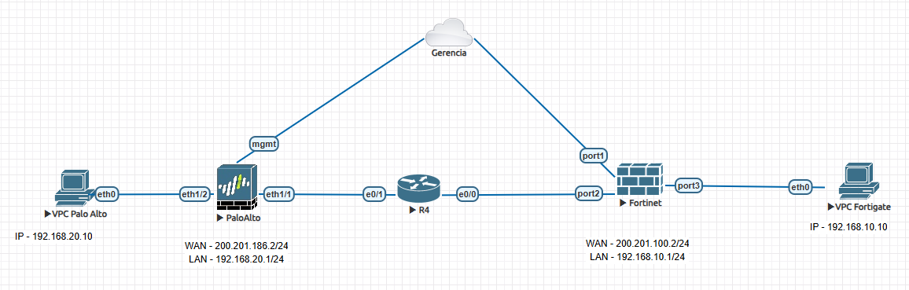

### 1.3 Endereçamento

Para o laboratório foram utilizados os seguintes endereçamentos:

| Parâmetro | FortiGate | Palo Alto |
|---|---|---|
| IP de Gerenciamento | 192.168.71.12 | 192.168.71.11 |
| IP WAN | 200.201.100.2 | 200.201.186.2 |
| Rede Local | 192.168.10.0/24 | 192.168.20.0/24 |
| IP do Túnel | 169.255.1.1/30 | 169.255.1.2/30 |

### 1.4 Componentes utilizados

O laboratório foi implementado utilizando o EVE-NG para simulação dos equipamentos.

Os principais componentes utilizados foram:

| Componente | Função |
|---|---|
| EVE-NG | Plataforma utilizada para execução do laboratório |
| FortiGate | Firewall responsável por uma das extremidades da VPN |
| Palo Alto | Firewall responsável pela outra extremidade da VPN |
| Roteador | Responsável pela comunicação entre as redes WAN dos firewalls |
| VPC FortiGate | Equipamento utilizado para testes na rede 192.168.10.0/24 |
| VPC Palo Alto | Equipamento utilizado para testes na rede 192.168.20.0/24 |
| Python | Linguagem utilizada para desenvolvimento dos scripts de automação |

---

## 2. Limitações do Laboratório

### 2.1 Versões utilizadas

Durante a implementação do laboratório foram utilizadas as seguintes versões:

| Equipamento | Versão |
|---|---|
| FortiGate | FortiOS 7.2.1 |
| Palo Alto | PAN-OS 8.1.0 |

As versões utilizadas no laboratório são diferentes das versões adotadas como referência no documento de planejamento. Por esse motivo, algumas estruturas e comportamentos das APIs foram adaptados durante a implementação prática.

### 2.2 Limitações de licenciamento

O FortiGate utilizado no laboratório possui limitações relacionadas à licença de avaliação.

Durante os testes foi identificada uma limitação nas propostas criptográficas disponíveis para a configuração da VPN IPSec. Por esse motivo, foi necessário utilizar DES com SHA-256 no ambiente de laboratório.

A utilização de DES ocorreu exclusivamente devido às limitações do ambiente de testes. Esse algoritmo é considerado inseguro e não é recomendado para ambientes de produção.

No planejamento da solução foram mantidas propostas criptográficas mais seguras, como AES-256 e SHA-256.

### 2.3 Adaptações realizadas no laboratório

Devido às versões dos equipamentos e às limitações encontradas no ambiente de laboratório, alguns parâmetros definidos no planejamento original precisaram ser adaptados para permitir a implementação prática da VPN.

A principal adaptação realizada foi a alteração da proposta de criptografia utilizada nas fases da VPN:

| Parâmetro | Planejamento | Laboratório |
|---|---|---|
| Criptografia | AES-256 | DES |
| Integridade | SHA-256 | SHA-256 |
| Diffie-Hellman | Grupo 20 | Grupo 20 |
| IKE | IKEv2 | IKEv2 |
| Phase 1 Lifetime | 28800 segundos | 28800 segundos |
| Phase 2 Lifetime | 3600 segundos | 3600 segundos |

Essas adaptações foram realizadas apenas para possibilitar os testes no ambiente disponível, sem alterar o objetivo e o fluxo da automação proposta.

## 3. Configuração Inicial

Antes de iniciar os testes de automação, foram realizadas as configurações iniciais necessárias para o funcionamento do laboratório e para garantir a comunicação entre os equipamentos.

### 3.1 FortiGate

#### Interface LAN

```
config system interface
    edit "port3"
        set ip 192.168.10.1 255.255.255.0
        set allowaccess ping
        set alias "LAN"
        set role lan
    next
end
```

#### Interface WAN

```
config system interface
    edit "port2"
        set ip 200.201.100.2 255.255.255.0
        set allowaccess ping
        set alias "WAN"
    next
end
```


#### Rota

```
config router static
    edit 1
        set dst 200.201.186.0 255.255.255.0
        set gateway 200.201.100.1
        set device "port2"
    next
end
```

### 3.2 Palo Alto

Antes da execução dos scripts de automação, foram realizadas as configurações básicas das interfaces WAN e LAN, zonas de segurança e roteamento necessário para comunicação externa.

#### Configuração das interfaces

```text
configure

set network interface ethernet ethernet1/1 layer3 ip 200.201.186.2/24
set network interface ethernet ethernet1/2 layer3 ip 192.168.20.1/24

set network interface ethernet ethernet1/1 link-state up
set network interface ethernet ethernet1/2 link-state up
```

#### Configuração das zonas

```text
set zone EXTERNA network layer3 ethernet1/1
set zone INTERNA network layer3 ethernet1/2
```

#### Configuração do Virtual Router

```text
set network virtual-router default interface ethernet1/1
set network virtual-router default interface ethernet1/2
```

#### Configuração da rota default

```text
set network virtual-router default routing-table ip static-route ROTA-DEFAULT destination 0.0.0.0/0 nexthop ip-address 200.201.186.1
set network virtual-router default routing-table ip static-route ROTA-DEFAULT destination 0.0.0.0/0 interface ethernet1/1
```

Após a configuração inicial:

```text
commit
```

### 3.3 Estado inicial antes da automação

Após a configuração inicial dos equipamentos, foi validada a comunicação entre os endereços WAN dos firewalls.

Neste momento, nenhuma configuração relacionada à VPN IPSec estava presente nos equipamentos.

Teste de conetividade wan entre FortiGate e Palo Alto

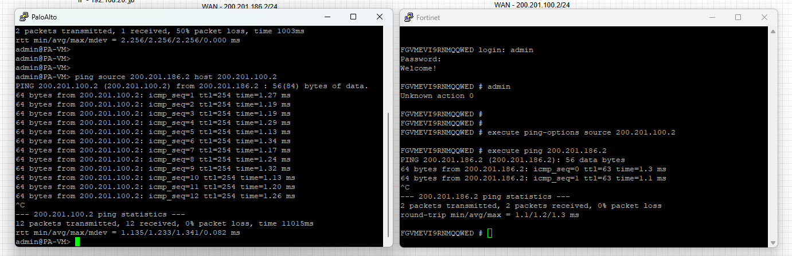

## 4. Scripts Desenvolvidos

### 4.1 Estrutura dos arquivos

Para realizar a automação foram desenvolvidos três scripts em Python. Para facilitar os testes e o troubleshooting de cada equipamento, os scripts de configuração do FortiGate e do Palo Alto ficaram separados. Também separamos o script de validação para que ele não seja executado antes dos dois equipamentos estarem configurados.

Todos os parâmetros foram consolidados em um arquivo `config.json`.

```text
automações/
├── config.json
├── fortigate_vpn.py
├── paloalto_vpn.py
└── validar_vpn.py
```

| Arquivo            | Função                                                  |
| ------------------ | ------------------------------------------------------- |
| `config.json`      | Armazena os parâmetros utilizados na automação          |
| `fortigate_vpn.py` | Configura os componentes da VPN no FortiGate            |
| `paloalto_vpn.py`  | Configura os componentes da VPN no Palo Alto            |
| `validar_vpn.py`   | Verifica o estado operacional da VPN nos dois firewalls |


### 4.2 Arquivo config.json

Para evitar que os parâmetros do laboratório ficassem espalhados dentro dos scripts, foi utilizado o arquivo config.json.

Nesse arquivo são definidos os endereços de gerenciamento, interfaces, redes locais, endereços WAN, endereçamento do túnel, nomes dos objetos e parâmetros utilizados na VPN.

Dessa forma, alterações nos parâmetros do ambiente podem ser realizadas no arquivo de configuração sem a necessidade de modificar diretamente a lógica dos scripts.

### 4.3 Script fortigate_vpn.py

O script `fortigate_vpn.py` foi desenvolvido utilizando a API REST do FortiGate, onde cada item foi testado separadamente antes do desenvolvimento do script final consolidado.

Antes de realizar uma configuração, o script valida se ela já existe. Caso exista, ele compara com os parâmetros definidos no `config.json`. Caso não exista, ele realiza a criação.

No final, ele informa se as configurações foram realizadas corretamente ou se foi encontrada alguma falha ou divergência.

### 4.4 Script paloalto_vpn.py

O script `paloalto_vpn.py` foi desenvolvido utilizando a XML API do Palo Alto.

Assim como no Fortigate, ele foi testado item a item separadamente. Antes de realizar uma configuração, o script valida se ela já existe. Caso exista, ele compara com os parâmetros definidos no `config.json`. Caso não exista, ele realiza a criação.

Como o Palo Alto utiliza o processo de commit, no final do script ele pergunta se o usuário deseja continuar e executar o commit. Caso confirmado, o script inicia o commit e acompanha sua execução até a finalização, informando se foi concluído com sucesso ou se ocorreu algum erro.

### 4.5 Script validar_vpn.py

Após a configuração dos dois equipamentos, ainda não temos a garantia de que a VPN esteja operacional.
Esse script realiza consultas nos dois firewalls após a configuração. No FortiGate é verificado o estado da VPN e de sua Phase 2. No Palo Alto são consultadas as SAs de IKE e IPSec.

Apesar dos testes estarem no mesmo script, ao final é possível identificar separadamente o estado da VPN em cada firewall.

### 4.6 Tratamento de credenciais

Mesmo sendo um ambiente de laboratório, as credenciais e senhas não foram armazenadas nos scripts.

Tokens de acesso às APIs, API Keys e a chave pré-compartilhada da VPN (PSK) são obtidos através de variáveis de ambiente.

Abaixo seguem as variáveis que devem ser criadas:

```text
FORTIGATE_TOKEN
FORTIGATE_PSK
PALOALTO_API_KEY
PALOALTO_PSK
```

## 5. Implementação e Testes da Automação

### 5.1 Preparação do ambiente para o teste

Conforme informado anteriormente, foram realizados diversos testes durante o desenvolvimento da automação. Para realizar o teste final e documentar a implementação, as configurações relacionadas à VPN foram removidas e o laboratório foi preparado novamente a partir do estado inicial. Dessa forma, todas as configurações da VPN apresentadas a seguir foram aplicadas pelos scripts.

### 5.2 Execução da automação no FortiGate

Foi executado inicialmente o script responsável pela automação do FortiGate:

python fortigate_vpn.py

Durante a execução, o script realizou consultas através da API REST para verificar a existência das configurações necessárias. Como o teste foi realizado a partir de um ambiente sem a configuração da VPN, os objetos necessários foram criados pelo script.

Durante essa etapa foram configurados:

Phase 1 da VPN;
Phase 2;
endereço da interface do túnel;
rota para a rede remota;
objetos de endereço das redes;
política LAN → VPN;
política VPN → LAN.

Ao final da execução, o script realizou a validação das configurações e informou a conclusão da configuração do FortiGate.

#### Evidências

Script Fortigate executado OK
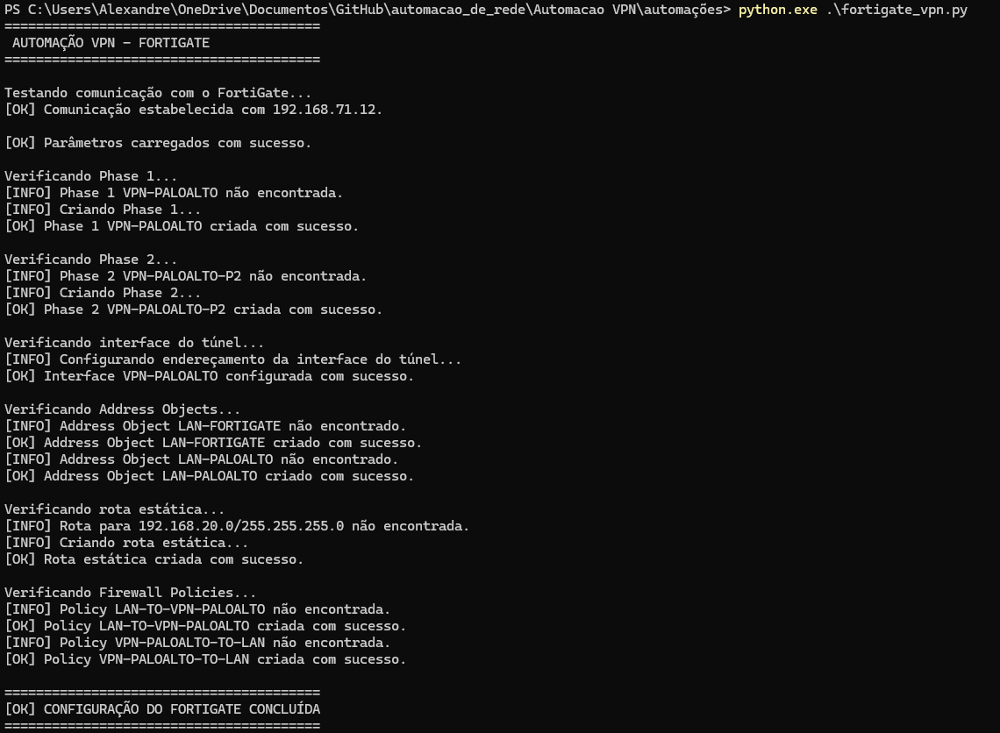

Configurações da VPN criadas no Fortigate
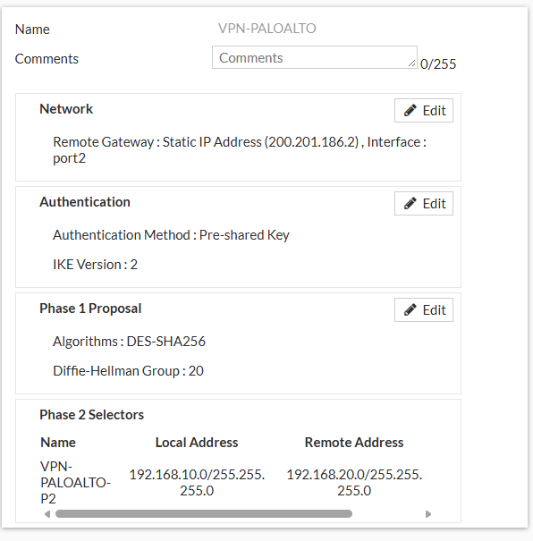
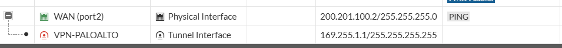
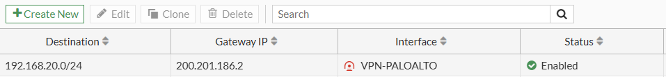
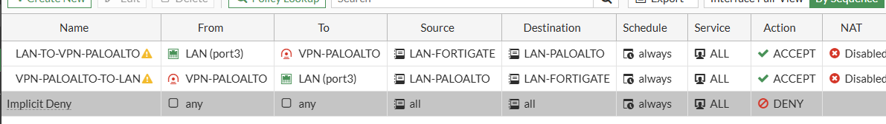

### 5.3 Execução da automação no Palo Alto

Após finalizar a configuração do FortiGate, foi executado o script responsável pela automação do Palo Alto:

python paloalto_vpn.py

Durante a execução, o script realizou consultas através da XML API para verificar a existência das configurações necessárias. Como o teste foi realizado a partir de um ambiente sem a configuração da VPN, os objetos necessários foram criados na Candidate Configuration do equipamento.

Durante essa etapa foram configurados:

IKE Crypto Profile;
IKE Gateway;
IPSec Crypto Profile;
interface tunnel.1;
associação da interface ao Virtual Router;
zona VPN;
IPSec Tunnel;
Proxy ID;
rota para a rede remota;
políticas de segurança.

Após a criação e validação das configurações, o script identificou que haviam sido realizadas alterações na Candidate Configuration e solicitou a confirmação para execução do commit. Após a confirmação, o commit foi iniciado e o script acompanhou o Job até sua conclusão.

#### Evidências

Script Palo Alto executado com sucesso

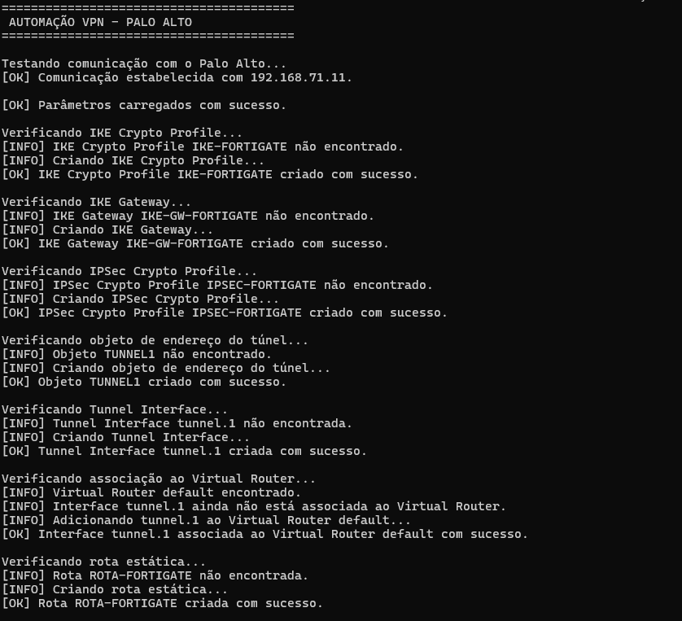
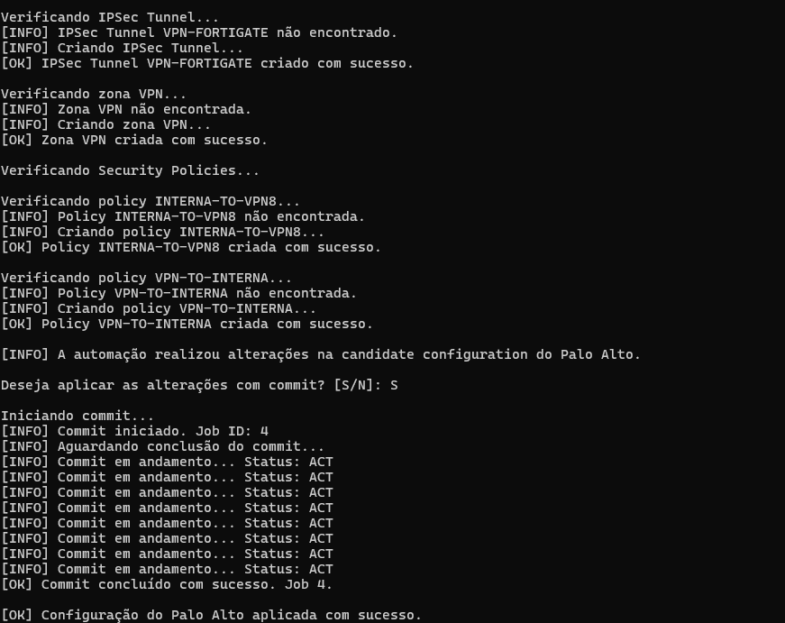

Configurações da VPN criadas no Palo Alto

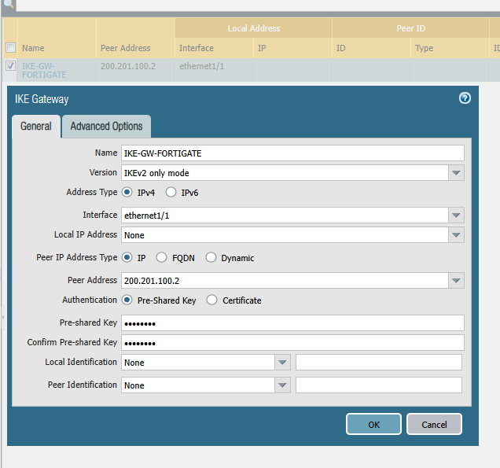

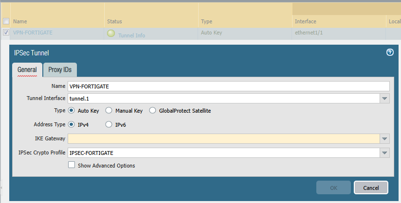

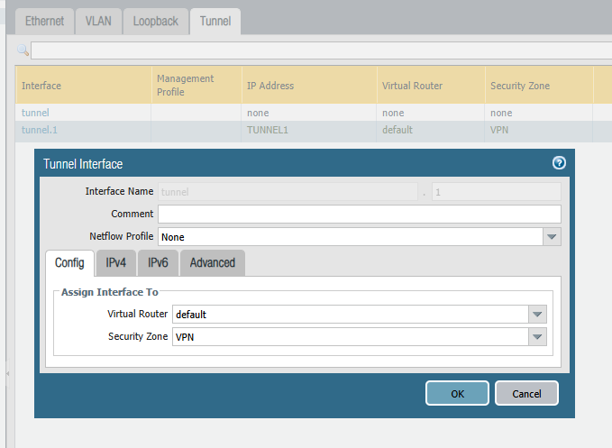

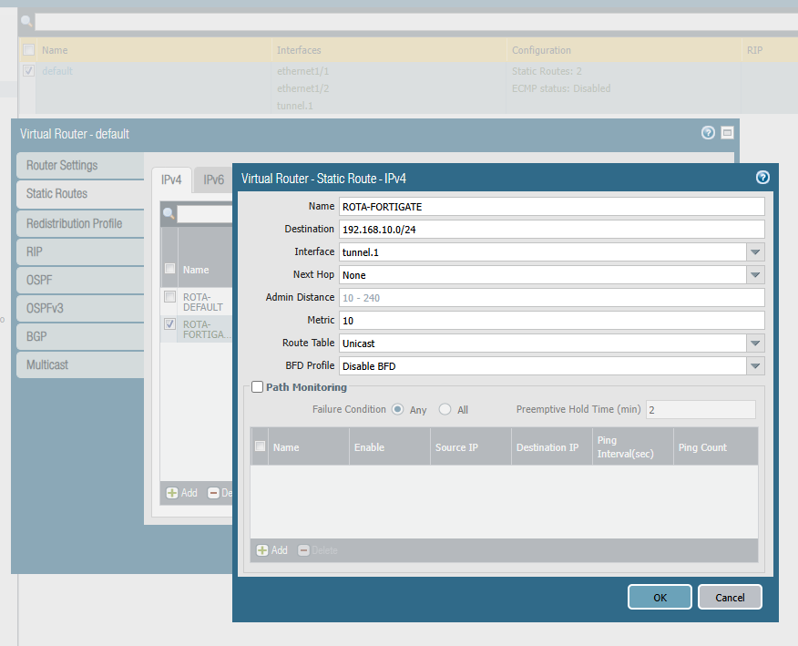

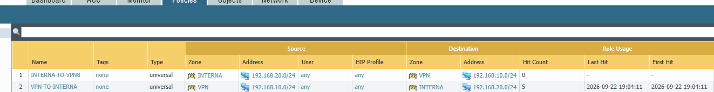


## 6. Validação da VPN

### 6.1 Teste de conectividade entre as redes

Após a configuração dos dois firewalls, foi gerado tráfego entre as redes LAN para iniciar a negociação da VPN.

O teste foi realizado através de ICMP entre uma VPC da rede 192.168.10.0/24 e uma VPC da rede 192.168.20.0/24.

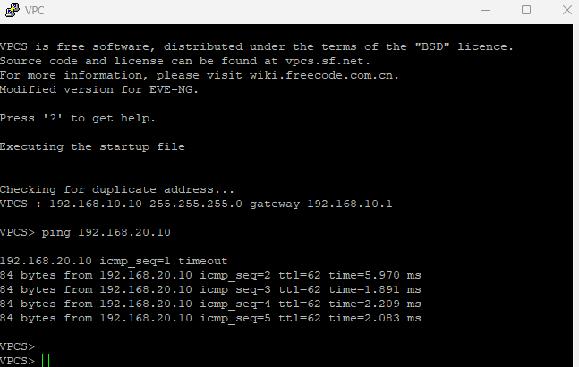

Durante os testes foi observado que a Phase 2 poderia permanecer no estado `down` enquanto não houvesse tráfego entre as redes protegidas. Após a geração de tráfego, a negociação foi iniciada e a Phase 2 passou para o estado `up`.

### 6.2 Validação operacional da VPN

Após o estabelecimento da VPN, foi executado o script de validação para consultar o estado operacional nos dois firewalls.

No FortiGate, o script localizou a VPN e sua respectiva Phase 2 e verificou seu estado operacional.

No Palo Alto, foram consultadas as SAs de IKE e IPSec, verificando a existência das associações correspondentes ao gateway e ao túnel configurados.

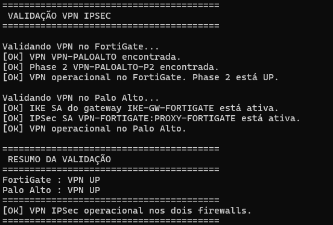


## 7. Teste de Reexecução da Automação

Após a criação e validação da VPN, os scripts foram executados novamente sem remover as configurações existentes.

O objetivo desse teste foi verificar se a automação identifica os objetos já configurados e evita a criação de configurações duplicadas ou alterações desnecessárias.

Durante a segunda execução, os scripts consultaram os objetos existentes e compararam suas configurações com os parâmetros definidos no arquivo config.json.

### 7.1 Segunda execução no FortiGate

Durante a segunda execução, o script verificou novamente as configurações existentes no equipamento, permitindo validar seu comportamento quando os objetos da VPN já estavam presentes.

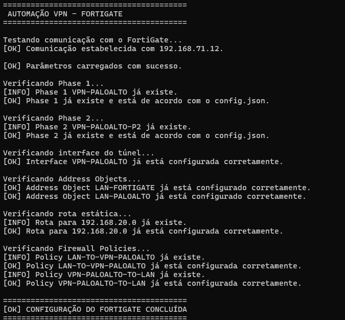

### 7.2 Segunda execução no Palo Alto

No Palo Alto, o script também realizou novamente as consultas das configurações existentes, permitindo validar seu comportamento com a VPN já configurada.

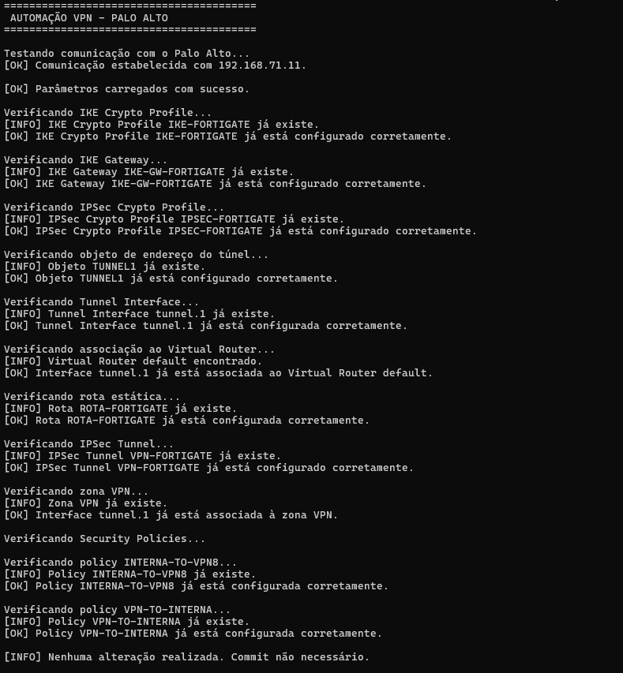

## 8. Considerações Finais

O laboratório permitiu colocar em prática o planejamento realizado para a automação de uma VPN IPSec entre equipamentos de fabricantes diferentes.

Através dos scripts desenvolvidos em Python, foi possível automatizar a criação das configurações necessárias no FortiGate e no Palo Alto, utilizando a API REST do FortiGate e a XML API do Palo Alto.

Durante a implementação foi possível observar algumas diferenças entre os fabricantes, principalmente na forma de utilização das APIs e no processo de aplicação das configurações. No Palo Alto, por exemplo, as alterações são realizadas inicialmente na Candidate Configuration e precisam posteriormente ser aplicadas através de um commit.

Após a execução da automação, foram realizados testes de conectividade e consultas operacionais que permitiram confirmar o estabelecimento da VPN e a comunicação entre as redes locais.

Também foi realizada uma nova execução dos scripts com a VPN já configurada, permitindo verificar o comportamento da automação quando os objetos já existem e evitando a criação de configurações duplicadas.

Apesar das limitações encontradas no ambiente de laboratório, principalmente relacionadas ao licenciamento e aos algoritmos criptográficos disponíveis, foi possível implementar e validar o fluxo de automação proposto.

Em um ambiente de produção, seria necessário utilizar algoritmos criptográficos mais seguros, conforme definido no planejamento, além de realizar as adequações necessárias de segurança, tratamento de certificados, controle de acesso às APIs e armazenamento seguro das credenciais.
